# Carbon Commit

Carbon Commit is a full-stack sustainability tracking platform for campus teams. It lets authenticated users record department activity, calculates carbon impact, compares usage against baseline quotas, and surfaces analytics and leaderboards for sustainability reporting.

The project is split into a Vite React frontend, an Express + TypeScript backend, and a Prisma-managed PostgreSQL schema connected to Supabase.

## What the app does

- Authenticates users with Supabase Auth.
- Protects the dashboard and API routes with bearer-token validation.
- Lets users submit department activity logs with units and activity type.
- Calculates CO2e from reference emission factors stored in the database.
- Aggregates department analytics, baseline variance, and leaderboard rankings.
- Seeds reference departments and emission factors for a working demo dataset.

## Tech Stack

- Frontend: React 19, Vite, TypeScript, Tailwind CSS, Recharts, Supabase JS
- Backend: Express 5, TypeScript, Zod, Supabase JS
- Database: PostgreSQL on Supabase
- ORM and schema management: Prisma

## Repository Layout

```text
Carbon Commit/
├── README.md
├── prisma.config.ts
├── backend/
│   ├── package.json
│   ├── prisma/
│   │   ├── schema.prisma
│   │   └── seed.ts
│   └── src/
│       ├── app.ts
│       ├── server.ts
│       ├── config/
│       ├── lib/
│       ├── middleware/
│       ├── routes/
│       └── services/
└── frontend/
    ├── package.json
    └── src/
        ├── App.tsx
        ├── main.tsx
        ├── components/
        ├── lib/
        ├── styles/
        └── types.ts
```

## Application Flow

1. The user signs up or signs in with Supabase Auth in the frontend.
2. The frontend keeps the session and attaches the access token to API requests.
3. The backend validates the bearer token with Supabase before allowing protected routes.
4. The activity service synchronizes the authenticated user into `user_profiles` before writing a log.
5. The backend reads and writes data through Prisma against the Supabase PostgreSQL database.
6. Analytics, leaderboard data, and notification feed items are derived from department baselines and logged emissions.

## Core Features

### 🔐 Authentication & Session Management
- Supabase Auth integration for secure sign-in and sign-up
- Bearer token validation on all protected API routes
- Session persistence and automatic token refresh
- Role-based access control (ADMIN, MANAGER, USER)

### 📝 Activity Logging & Tracking
- Submit department activity with units and activity type
- Real-time CO2 calculation using emission reference factors
- Paginated activity log with date, department, and quantity display
- Recent insertions view showing latest 10 submissions
- Success notifications on submission confirmation

### 📊 Analytics & Reporting
- Department-wise emissions aggregation
- Comparison against baseline quotas
- Trend analysis with interactive charts
- Role-based KPI cards with performance indicators
- Historical emissions data and patterns

### 🏆 Leaderboard & Rankings
- Department rankings by total emissions
- Baseline variance indicators (Over/Under quota)
- Real-time leaderboard updates
- Performance comparison visualization

### 📋 Audit & Compliance
- Complete audit trail of all actions
- User action tracking with timestamps
- Filter by user, action type, and date range
- Administrative review capabilities
- Reset filters for quick access to fresh data

### 📥 Import & Export
- Bulk CSV import for activity logs
- Multiple export formats (CSV, JSON)
- Inline import instructions
- Validation and error handling
- Timestamped exports for record-keeping

### 👤 User Profiles & Settings
- User account management
- Department assignment and selection
- Profile updates with real-time refresh
- Avatar support
- Session-based profile tracking

### 🔔 Notifications & Alerts
- Real-time notification center
- Quota breach warnings
- Activity confirmation messages
- System status updates
- Dismissible notifications

### 📱 Responsive Design
- Dark-themed interface with modern gradient backgrounds
- High-contrast cyan accents for accessibility
- Responsive grid layouts for all screen sizes
- Smooth animations and transitions
- Toast notifications for user feedback

## Dashboard Snapshots

The Carbon Commit interface features a modern dark-themed design with teal/blue gradient backgrounds and cyan accent colors for high visibility.

The snapshots are stored in [docs/snapshots](docs/snapshots) and are embedded below so the README shows the actual site surfaces instead of just describing them.
These captures cover the full product surface: authentication, dashboard, operations, analytics, profile settings, and schema design.

### Snapshot Gallery

| Site Area | Snapshot |
| --- | --- |
| Authentication screen | 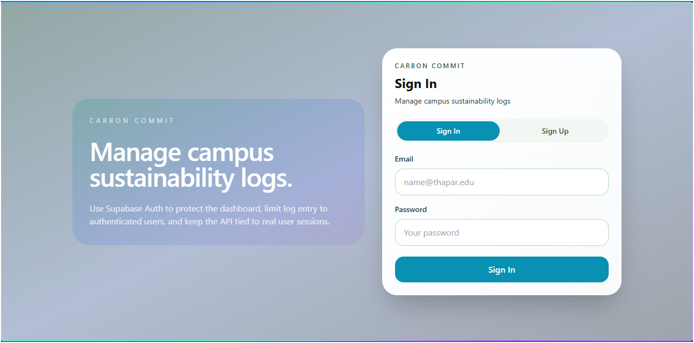 |
| Dashboard overview | 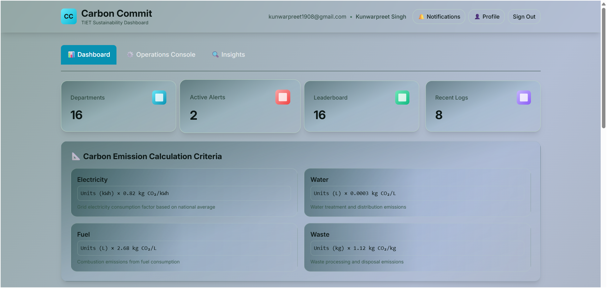 |
| Activity log / operations history | 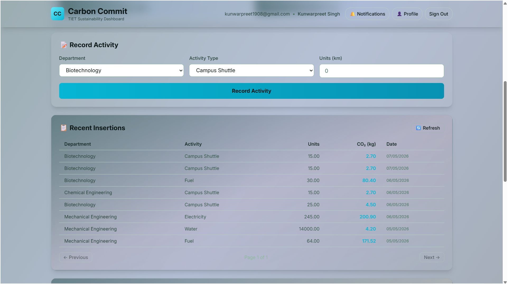 |
| Profile settings panel | 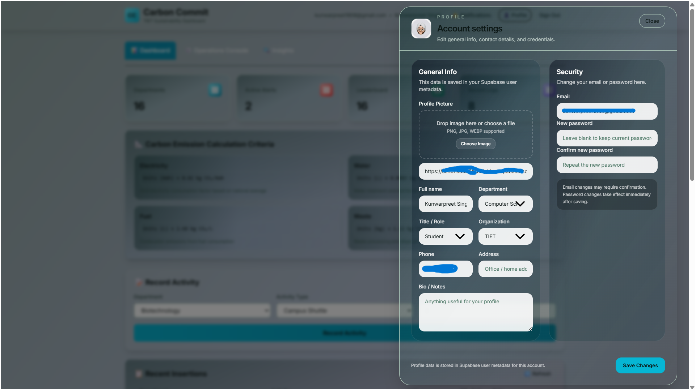 |
| Database schema snapshot | 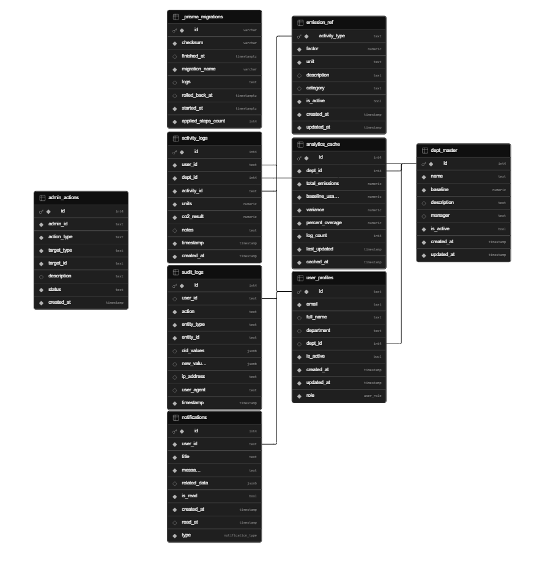 |

### Full Snapshot Gallery

#### 🔐 Authentication & Auth Flow
| | |
|---|---|
|  | 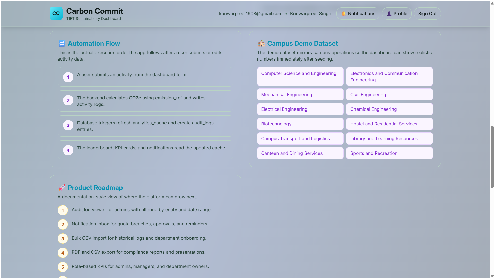 |

#### 📊 Dashboard & KPIs
| | |
|---|---|
|  | 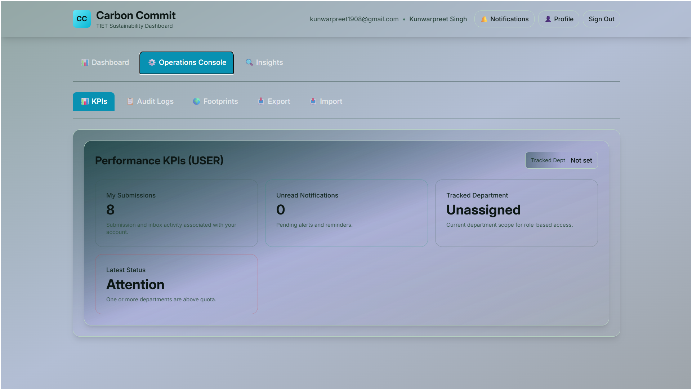 |

#### 📋 Operations & Activity Logging
| | |
|---|---|
|  | 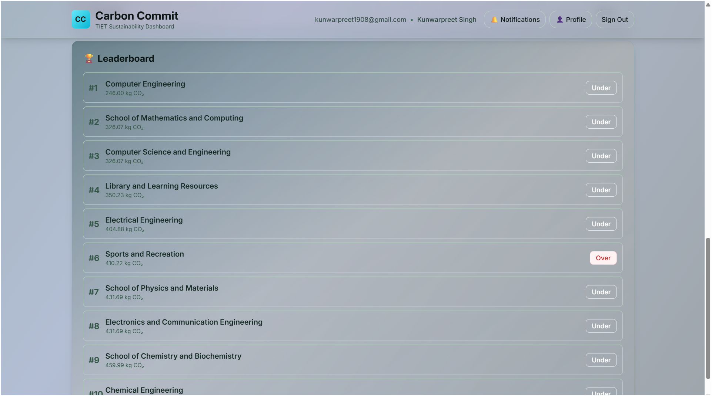 |

#### 🌍 Analytics & Footprints
| | |
|---|---|
| 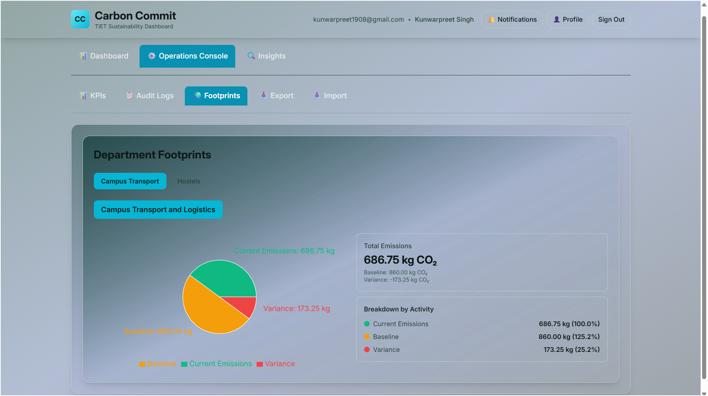 | 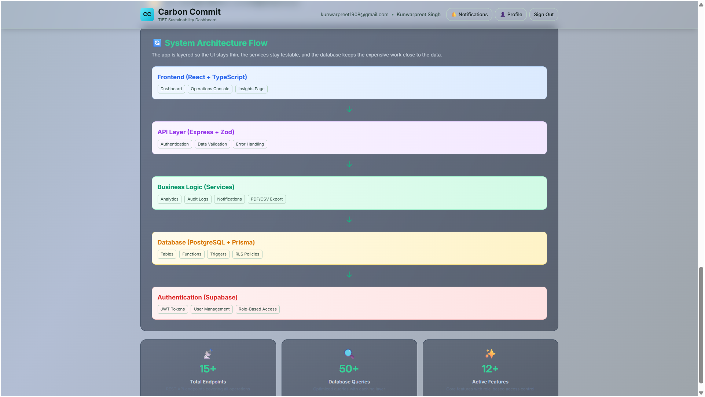 |

#### 📥 Import & 📤 Export
| | |
|---|---|
| 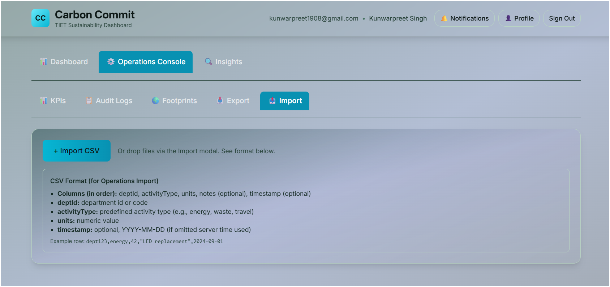 | 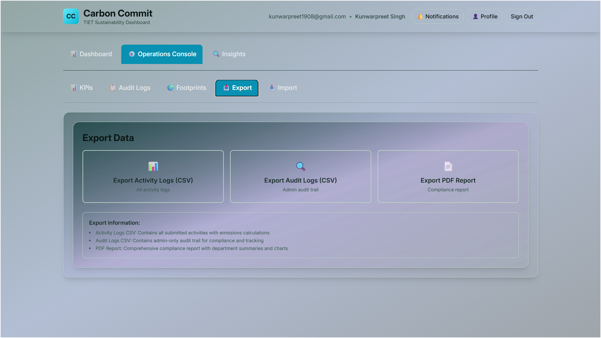 |

#### 📋 Audit & 🔔 Notifications
| | |
|---|---|
| 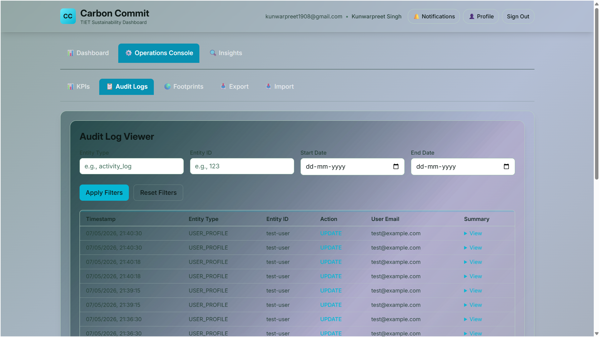 | 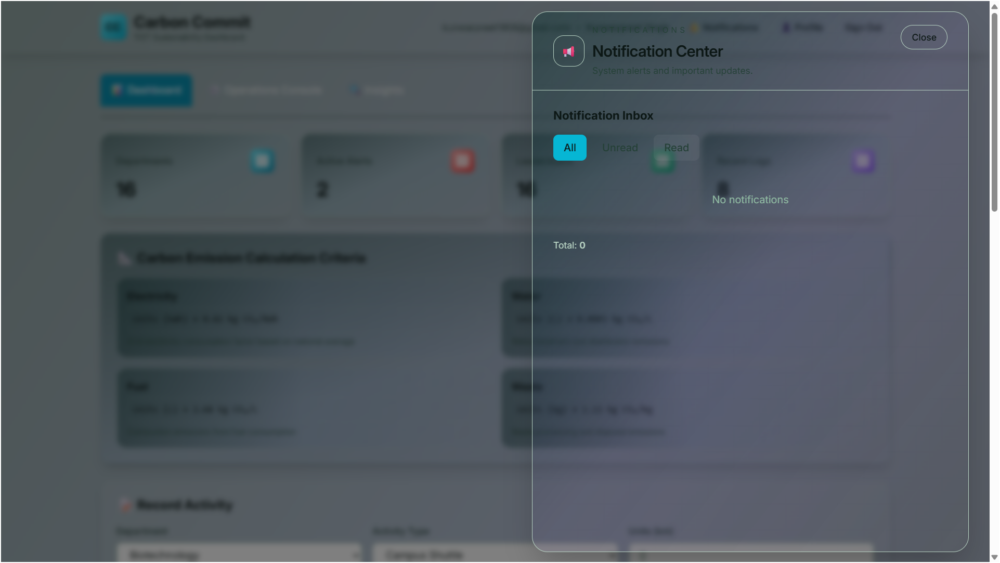 |

#### 📐 Project Insights & Architecture
| | |
|---|---|
| 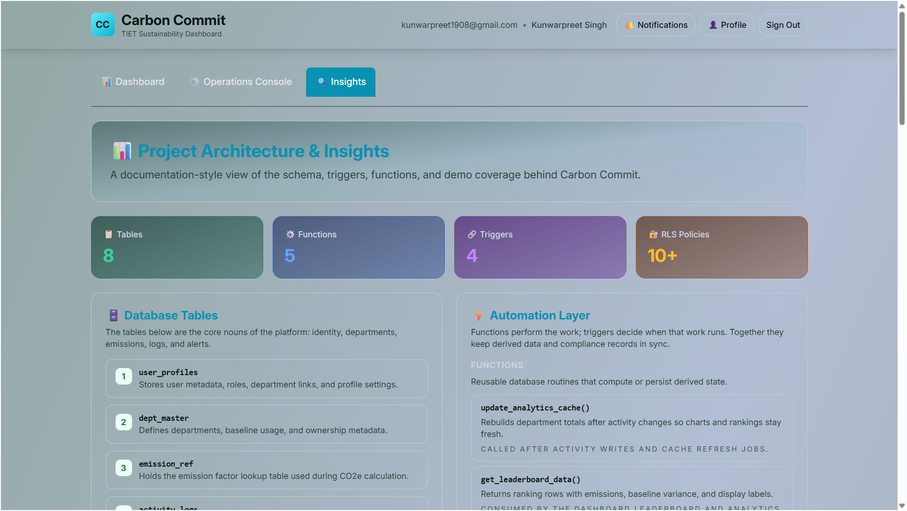 | 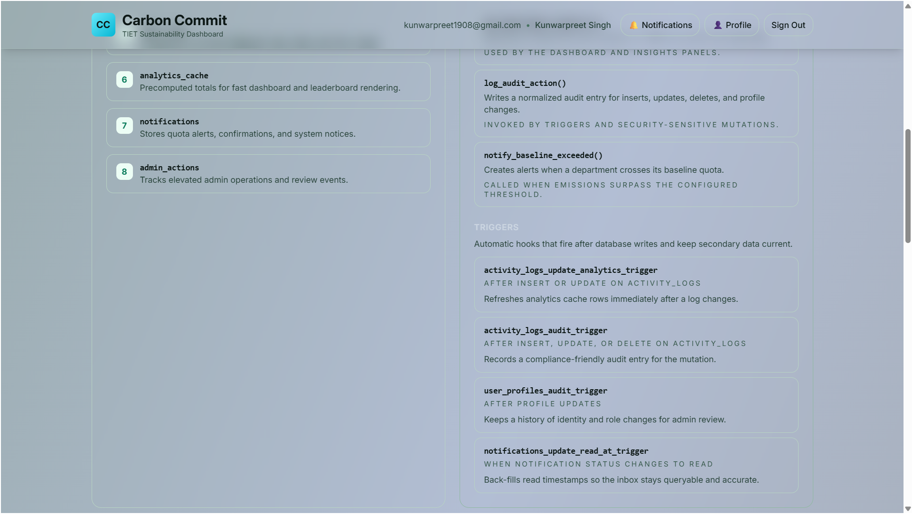 |

#### 👤 Profile & Settings
| | |
|---|---|
|  |  |

If you want to explore the app, check out the full interface above—every major section is captured in the snapshots.

### 🔐 Authentication Screen


- Sign In / Sign Up interface with Supabase Auth integration
- Welcome message and project description panel
- Email and password inputs with validation
- Responsive design with cyan action buttons

### 📊 Dashboard Tabs


The main dashboard is organized into five primary sections accessible via tab navigation:

#### **KPIs (Key Performance Indicators)**
- Role-based performance metrics display
- Real-time tracked department indicator
- Performance status cards with color-coded indicators
- Department analytics at a glance

#### **⚙️ Operations Console** 


- **Carbon Emission Calculation Criteria**: Reference emission factors with formulas
  - Electricity: Units (kWh) × 0.82 kg CO₂/kWh
  - Water: Units (L) × 0.0003 kg CO₂/L
  - Fuel: Units (L) × 2.68 kg CO₂/L
  - Waste: Units (kg) × 1.12 kg CO₂/kg
- **Recent Insertions**: Paginated activity log showing latest submissions
- **Leaderboard**: Department rankings by emissions with baseline variance indicators

#### **📋 Audit Logs**


- Complete audit trail of all user actions
- Filtering by user, action type, and date range
- Reset filters button for quick view refresh
- Detailed action tracking and timestamps

#### **🌍 Footprints (Analytics)**


- Interactive emissions trend chart
- Section-based views: Transport, Hostel, Facilities
- Department-wise footprint breakdown
- Historical trend analysis

#### **📥 Import / 📤 Export**


- **Import**: CSV bulk upload with inline instructions
  - Format: `DepartmentID, ActivityType, Units, Description, Date`
  - No header row required
  - Real-time validation and error feedback
- **Export**: Download analytics and logs as CSV/JSON
  - Multiple export format options
  - Timestamped file downloads

-### 👤 Profile Panel


- User account settings and avatar management
- Department selection with dropdown (predefined options)
- Role display
- Save changes with success notifications
- Profile updates trigger dashboard data refresh

### 📐 Project Insights


- Architecture overview with system components
- Database schema summary
- Technology stack details
- Feature roadmap and implementation notes
- Color-coded architecture boxes

### 📬 Notifications


- Real-time notification center
- Quota breach alerts
- Activity submission confirmations
- System status updates
- Dismissible notification items

### 🎨 Visual Design
- **Background**: Teal/blue gradient (from-teal-950/40 via-blue-900/30 to-slate-800/40)
- **Panels**: Light panels with subtle gradients for visual separation
- **Accents**: Cyan color (#06b6d4) for buttons and active states
- **Text**: High contrast white text on dark backgrounds, dark text on light panels
- **Rounded Corners**: Consistent 2xl and 3xl border radius throughout
- **Shadows**: Depth with subtle shadow effects on panels

## Backend Details

The backend lives in [backend/src](backend/src) and is started from [backend/src/server.ts](backend/src/server.ts).

Important backend pieces:

- [backend/src/app.ts](backend/src/app.ts) wires Express, CORS, JSON parsing, the health endpoint, auth middleware, and API routers.
- [backend/src/middleware/requireAuth.ts](backend/src/middleware/requireAuth.ts) validates Supabase bearer tokens.
- [backend/src/routes/logs.ts](backend/src/routes/logs.ts) handles activity log creation.
- [backend/src/routes/analytics.ts](backend/src/routes/analytics.ts) returns analytics, reference data, and leaderboard data.
- [backend/src/routes/leaderboard.ts](backend/src/routes/leaderboard.ts) exposes the leaderboard endpoint.
- [backend/src/services/activity.service.ts](backend/src/services/activity.service.ts) contains the carbon calculations and aggregation logic.
- [backend/prisma/schema.prisma](backend/prisma/schema.prisma) defines the database models.
- [backend/prisma/seed.ts](backend/prisma/seed.ts) seeds departments and emission factors.

### Backend Scripts

From the backend directory:

- `npm run dev` starts the backend in watch mode.
- `npm run build` compiles the backend TypeScript.
- `npm run start` runs the built server from `dist`.
- `npm run prisma:generate` generates the Prisma client.
- `npm run prisma:migrate` runs Prisma migrate dev.
- `npm run seed` runs the database seed script.

## Frontend Details

The frontend lives in [frontend/src](frontend/src) and is bootstrapped from [frontend/src/main.tsx](frontend/src/main.tsx).

Important frontend pieces:

- [frontend/src/App.tsx](frontend/src/App.tsx) renders the protected app shell.
- [frontend/src/components/ProtectedDashboard.tsx](frontend/src/components/ProtectedDashboard.tsx) loads the session and gates access.
- [frontend/src/components/AuthScreen.tsx](frontend/src/components/AuthScreen.tsx) handles sign in and sign up.
- [frontend/src/components/Dashboard.tsx](frontend/src/components/Dashboard.tsx) contains the main sustainability dashboard.
- [frontend/src/lib/api.ts](frontend/src/lib/api.ts) wraps authenticated API calls.
- [frontend/src/lib/supabase.ts](frontend/src/lib/supabase.ts) creates the browser Supabase client.

### Frontend Scripts

From the frontend directory:

- `npm run dev` starts the Vite dev server.
- `npm run build` type-checks and builds the frontend for production.
- `npm run preview` previews the production build locally.

## Environment Variables

### Backend Environment

Create [backend/.env](backend/.env) with the following values:

- `DATABASE_URL`: Prisma runtime connection string.
- `DIRECT_URL`: Prisma direct or session-pooler connection string for schema operations.
- `SUPABASE_URL`: Your Supabase project URL.
- `SUPABASE_ANON_KEY`: Supabase anon key.
- `SUPABASE_SERVICE_ROLE_KEY`: Supabase service role key for backend auth checks and privileged operations.
- `PORT`: Backend port, defaults to `4000`.

The backend is configured through [backend/src/config/env.ts](backend/src/config/env.ts).

### Frontend Environment

Create [frontend/.env](frontend/.env) from [frontend/.env.example](frontend/.env.example):

- `VITE_SUPABASE_URL`
- `VITE_SUPABASE_PUBLISHABLE_KEY`
- `VITE_SUPABASE_ANON_KEY`
- `VITE_API_BASE_URL`

The frontend Supabase client prefers `VITE_SUPABASE_PUBLISHABLE_KEY` and falls back to `VITE_SUPABASE_ANON_KEY` for compatibility.

## Supabase and Prisma Setup

This repo uses two different database connection patterns:

- `DATABASE_URL` is the main runtime connection used by Prisma Client.
- `DIRECT_URL` is the connection Prisma uses for schema operations such as pushes and migrations.

For Supabase, the usual pattern is:

- Transaction pooler for runtime traffic.
- Direct connection or session pooler for schema operations.

In some environments, the direct Supabase host is not reachable from the local machine. In that case, a reachable session pooler can be used for local schema sync and seeding.

The repo includes a Prisma config file at [prisma.config.ts](prisma.config.ts) to support current Prisma CLI behavior.

## Database Models

The Prisma schema defines three main tables used by the dashboard flow:

- `DeptMaster`: department names and baseline emission quotas.
- `EmissionRef`: activity types, factors, and units.
- `ActivityLogs`: recorded department activity and calculated CO2e.

These map to the following database tables:

- `dept_master`
- `emission_ref`
- `activity_logs`

## Seed Data

The seed script now inserts a larger Thapar-inspired dataset for a campus-style demo:

- 15 departments across academic, lab, residential, transport, and operations categories.
- 8 emission factors covering energy, water, transport, waste, materials, and lab activity.
- 16 sample user profiles, including department leads and an admin account.
- 60 demo activity logs to populate analytics, alerts, and the leaderboard.

Seeded activity types include electricity, water, fuel, waste, paper, LPG, campus shuttle, and lab consumables.

## Local Development

### 1. Install dependencies

Install packages separately in each app folder:

- In `backend/`, run `npm install`.
- In `frontend/`, run `npm install`.

### 2. Configure backend environment

Set up [backend/.env](backend/.env) with your Supabase connection details and secrets.

### 3. Configure frontend environment

Copy [frontend/.env.example](frontend/.env.example) to [frontend/.env](frontend/.env) and fill in your project values.

### 4. Sync the schema

From `backend/`, run:

```bash
npm run prisma:generate
npx prisma db push
```

If you have a reachable direct database connection, you can also use Prisma migrations with `npm run prisma:migrate`.

### 5. Seed the database

From `backend/`, run:

```bash
npm run seed
```

### 6. Start the backend

From `backend/`, run:

```bash
npm run dev
```

The backend starts on the port defined by `PORT`, usually `http://localhost:4000`.

### 7. Start the frontend

From `frontend/`, run:

```bash
npm run dev
```

Then open the Vite URL shown in the terminal, usually `http://localhost:5173`.

## API Endpoints

### Public

- `GET /health` returns a basic service health check.

### Protected

All protected routes require a valid Supabase bearer token.

- `POST /logs` creates a new activity log.
- `GET /analytics` returns department analytics.
- `GET /analytics/reference-data` returns department and activity reference data.
- `GET /analytics/leaderboard` returns leaderboard data.
- `GET /leaderboard` returns the leaderboard data directly.

### Request Shape

For `POST /logs`, the backend expects:

- `deptId`: positive integer
- `activityType`: non-empty string
- `units`: positive number

## Troubleshooting

### Prisma cannot reach the database

If Prisma reports `P1001` or similar connection errors, the local machine may not be able to reach the direct Supabase host. Try a reachable session pooler URL for schema sync, or run the command from a network that can reach the direct database endpoint.

### Seed fails with missing tables

Run the schema sync first so the tables exist before seeding. The seed script expects `dept_master` and `emission_ref` to be present.

### Auth requests return 401

Make sure the frontend is using the correct Supabase project URL and publishable key, and that the access token is being attached to requests.

### API requests fail from the frontend

Confirm `VITE_API_BASE_URL` points at the backend server and that the backend is running.

## Notes on RLS

Supabase Row Level Security is useful for direct Supabase client access, but Prisma-backed access through the backend is still controlled by the database credentials used by Prisma. The current architecture uses Supabase Auth to protect the API, while Prisma handles the data model and queries.

## Suggested Next Steps

- Enhance import validation with detailed error reporting and CSV preview
- Add email notifications for quota breaches and milestone achievements
- Implement department comparison views and trend forecasting
- Add custom date range filtering for analytics
- Expand the seed data with more realistic multi-campus scenarios
- Implement cost tracking alongside carbon emissions
- Add collaborative goal-setting features for departments
- Create admin dashboard for user management and system monitoring
- Develop mobile app for on-the-go activity logging
